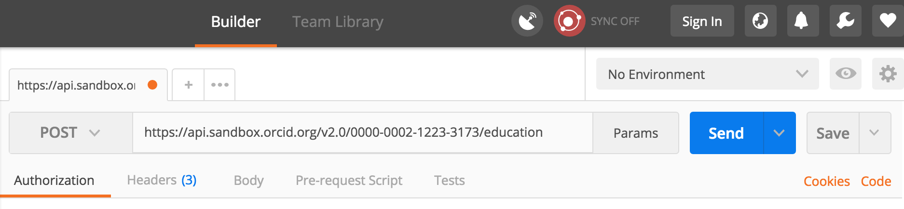
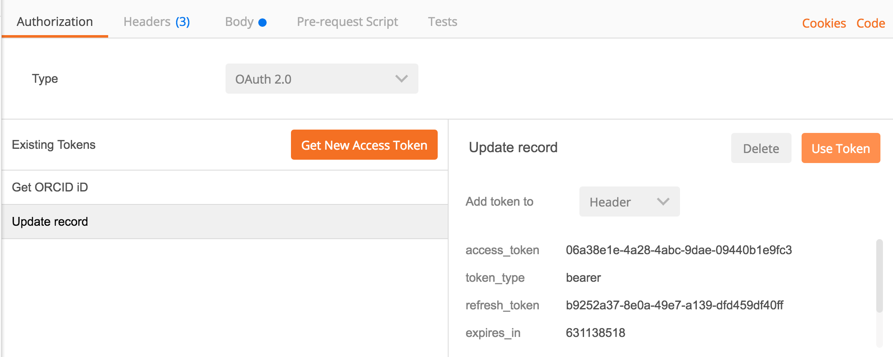
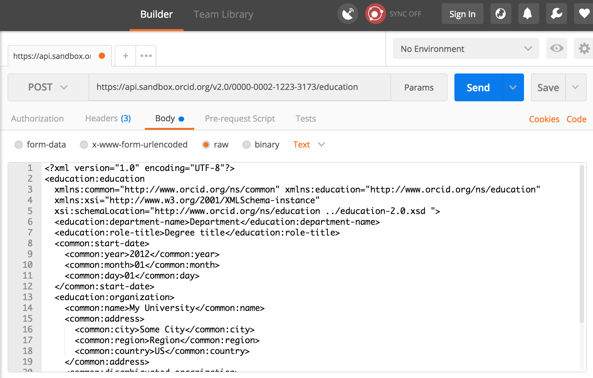

Now that we've got an Access Token, we can use it like a password to take the API actions we requested permission for (in this case, to update Activities). In this section, we'll add an education affiliation to our Sandbox record.

##Add an education affiliation
Still have that ORCID Sandbox access token saved in Postman? If so, continue with step 1 below. If not, go back and repeat the [Get an access token & authenticated ORCID iD](/collect/#get-an-access-token-authenticated-orcid-id) step from the previous section before moving on to the steps below.

1. In the Postman Builder tab, click the **+** sign at the top of the screen to create a new request.
2. Set the request type to **POST**.<br>
3. In the **Request URI** field enter:<br>
```https://api.sandbox.orcid.org/v2.0/[ORCID ID]/education```<br>
*Replace [ORCID ID] with the iD for your Sandbox record, format XXXX-XXXX-XXXX-XXXX*<br>

4. Click **Authorization**, select the **ORCID Sandbox** token, and set the **Add token to** dropdown to **Header**<br>

5. Click **Headers** and add the keys and values below (notice that Postman added the access token as a header)

| Key | Value |
| ------| ------|
|```Accept```| ```application/vnd.orcid+xml``` |
|```Content-type```| ```application/vnd.orcid+xml``` |


6. Click **Body** and set the format to **raw**
7. Copy the [education affiliation XML](#education-affiliation-xml) at the end of this section and paste it into the text box<br>

9. **OPTIONAL:** In the **Request Body** text box, edit the XML to reflect your institution.<br>
*For ```<disambiguated-organization-identifier>```, use the [Ringgold Identify database](http://ido.ringgold.com/identify_new/cfm/si_pd.cfm?PID=1) to find the Ringgold ID for your institution (you'll need to [register a free Ringgold account](http://ido.ringgold.com/identify_new/cfm/si_pd.cfm?PID=24) in order to search the database).*
11. Click **Send**.
12. Results will appear in the **Response** section at the bottom of the screen. If you see **Status: 201 Created**, your education affiliation was successfully added!<br>
<br>
***Got an error?** Check the [ORCID API error code reference](http://members.orcid.org/api/resources/error-codes) for help*
13. Visit the public view of your Sandbox record at ```http://sandbox.orcid.org/[ORCID ID]``` to see your new education affiliation.<br>
<br>
*Notice that **Source** shows the name of the API client that added the affiliation - this is a key element that helps other systems consuming ORCID data determine whether this piece of information is authoritative.**

##Education affiliation XML

```
<?xml version="1.0" encoding="UTF-8"?>
<education:education
  xmlns:common="http://www.orcid.org/ns/common" xmlns:education="http://www.orcid.org/ns/education"
  xmlns:xsi="http://www.w3.org/2001/XMLSchema-instance"
  xsi:schemaLocation="http://www.orcid.org/ns/education ../education-2.0.xsd "> 
  <education:department-name>Department</education:department-name>
  <education:role-title>Degree title</education:role-title>
  <common:start-date>
    <common:year>2012</common:year>
    <common:month>01</common:month>
    <common:day>01</common:day>
  </common:start-date>
  <education:organization>
    <common:name>My University</common:name>
    <common:address>
      <common:city>Some City</common:city>
      <common:region>Region</common:region>
      <common:country>US</common:country>
    </common:address>
    <common:disambiguated-organization>
      <common:disambiguated-organization-identifier>XXXXXX</common:disambiguated-organization-identifier>
      <common:disambiguation-source>RINGGOLD</common:disambiguation-source>
    </common:disambiguated-organization>
  </education:organization>     
</education:education>
```