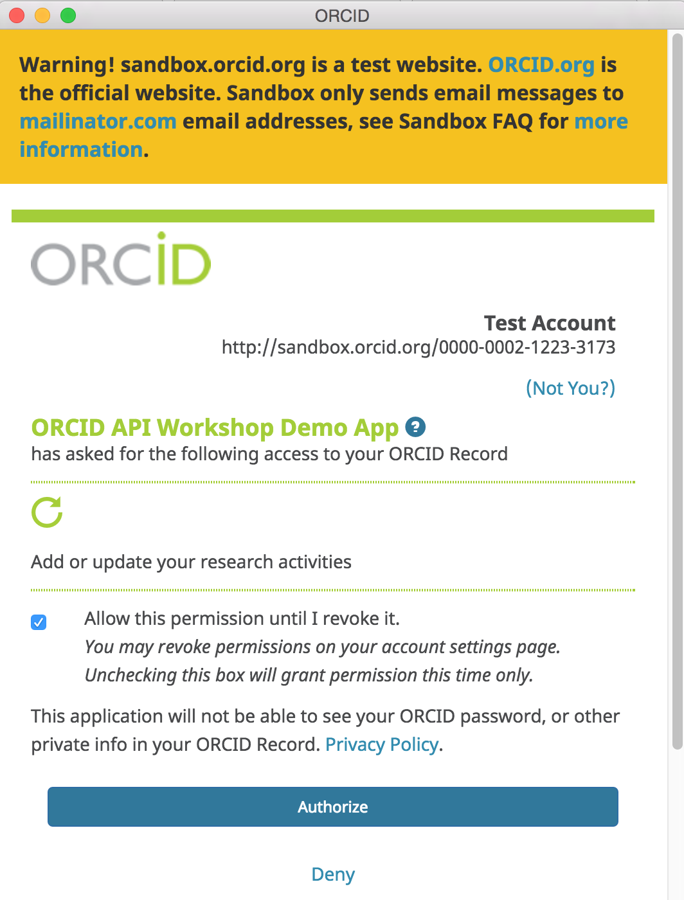

ORCID member organizations can use the API to add information from their systems, like affiliations, grants and publications, to user's records, making that information visible both to the user and to other systems that rely on ORCID data.

In this section, we'll use the Member API to add an education affiliation item to our Sandbox record. 

##Get an access token

Before we can add data to an ORCID record, we first need to get permission from the record owner via the same OAuth 2.0 process we used to get an authenticated iD in the previous section. 

***Why do we need permission?** Control over access to data in your ORCID record is one of [ORCID's core princples](https://orcid.org/about/what-is-orcid/principles). While you can read public data without the record owner's involvement, reading non-public data or making changes to data always requires the record owner's permission.* 

1. In the same Postman request tab that you used in the last section, click **Get New Access Token**
2. Change **Token Name** to **Update record** and **Scope** to ```/activites/update```. Leave all other fields as they were in the [Get an authenticated ORCID iD section](/collect/#get-an-authenticated-orcid-id)<br>
*```/activites/update``` scope generates a token that can be used to add/update items in the education, employment, funding and works sections of an ORCID record.*<br> 

3. Leave **Request access token locally** unchecked and click **Request Token**
2. An ORCID sign-in screen will appear; sign into the Sandbox ORCID account you created earlier. ***Note:** If you're already signed into ORCID in the same browser, this step will be skipped.*<br>

3. A screen asking you to grant permission to update your ORCID record will appear; click **Authorize**<br>

4. Beneath **Existing Tokens**, click **Update record**. The Access Token for the user who signed in will appear at right.<br>
<br>

##Add an education affiliation
Next, we'll use the access token generated in the previous section to add an education affiliation to our Sandbox ORCID record.

1. In the same Postman Builder tab, you were working in to generate the **Update record** access token, set the request type to **POST**.<br>
3. In the **Request URI** field enter:<br>
```https://api.sandbox.orcid.org/v2.0/[ORCID ID]/education```<br>
*Replace [ORCID ID] with the iD for your Sandbox record, format XXXX-XXXX-XXXX-XXXX*<br>

4. Click **Authorization**, select the **Update record** token, and set the **Add token to** dropdown to **Header**<br>

5. Click **Headers** and add the keys and values below (notice that Postman added the access token as a header)

| Key | Value |
| ------| ------|
|```Accept```| ```application/vnd.orcid+xml``` |
|```Content-type```| ```application/vnd.orcid+xml``` |


6. Click **Body** and set the format to **raw**
7. Copy the [education affiliation XML](#education-affiliation-xml) at the end of this section and paste it into the text box<br>

9. **OPTIONAL:** In the **Request Body** text box, edit the XML to reflect your institution.<br>
*For ```<disambiguated-organization-identifier>```, use the [Ringgold Identify database](http://ido.ringgold.com/identify_new/cfm/si_pd.cfm?PID=1) to find the Ringgold ID for your institution (you'll need to [register a free Ringgold account](http://ido.ringgold.com/identify_new/cfm/si_pd.cfm?PID=24) in order to search the database).*
11. Click **Send**.
12. Results will appear in the **Response** section at the bottom of the screen. If you see **Status: 201 Created**, your education affiliation was successfully added!<br>
<br>
***Got an error?** Check the [ORCID API error code reference](http://members.orcid.org/api/resources/error-codes) for help*
13. Visit the public view of your Sandbox record at ```http://sandbox.orcid.org/[ORCID ID]``` to see your new education affiliation.<br>
<br>
*Notice that **Source** shows the name of the API client that added the affiliation - this is a key element that helps other systems consuming ORCID data determine whether this piece of information is authoritative.**

##Education affiliation XML

```
<?xml version="1.0" encoding="UTF-8"?>
<education:education
  xmlns:common="http://www.orcid.org/ns/common" xmlns:education="http://www.orcid.org/ns/education"
  xmlns:xsi="http://www.w3.org/2001/XMLSchema-instance"
  xsi:schemaLocation="http://www.orcid.org/ns/education ../education-2.0.xsd "> 
  <education:department-name>Department</education:department-name>
  <education:role-title>Degree title</education:role-title>
  <common:start-date>
    <common:year>2012</common:year>
    <common:month>01</common:month>
    <common:day>01</common:day>
  </common:start-date>
  <education:organization>
    <common:name>My University</common:name>
    <common:address>
      <common:city>Some City</common:city>
      <common:region>Region</common:region>
      <common:country>US</common:country>
    </common:address>
    <common:disambiguated-organization>
      <common:disambiguated-organization-identifier>XXXXXX</common:disambiguated-organization-identifier>
      <common:disambiguation-source>RINGGOLD</common:disambiguation-source>
    </common:disambiguated-organization>
  </education:organization>     
</education:education>
```