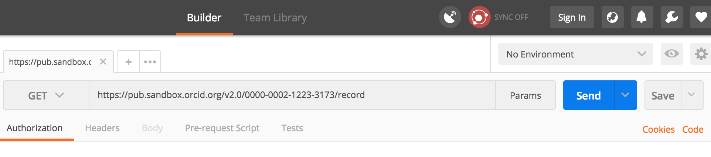
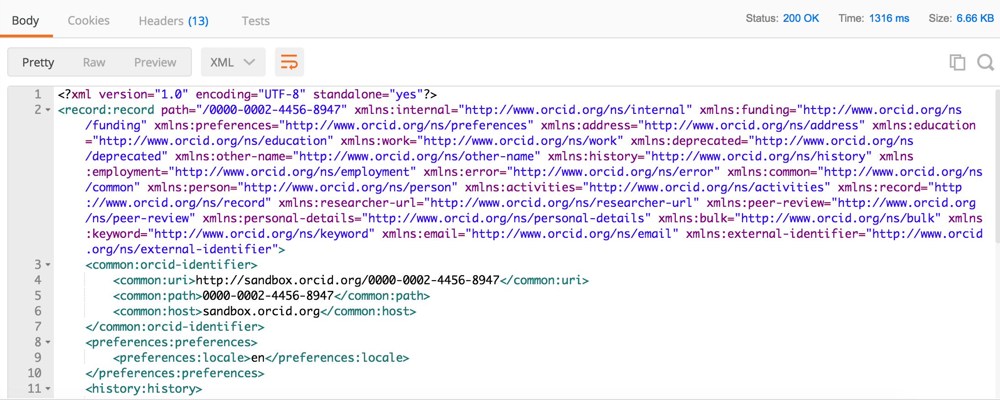
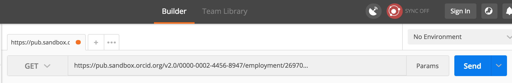
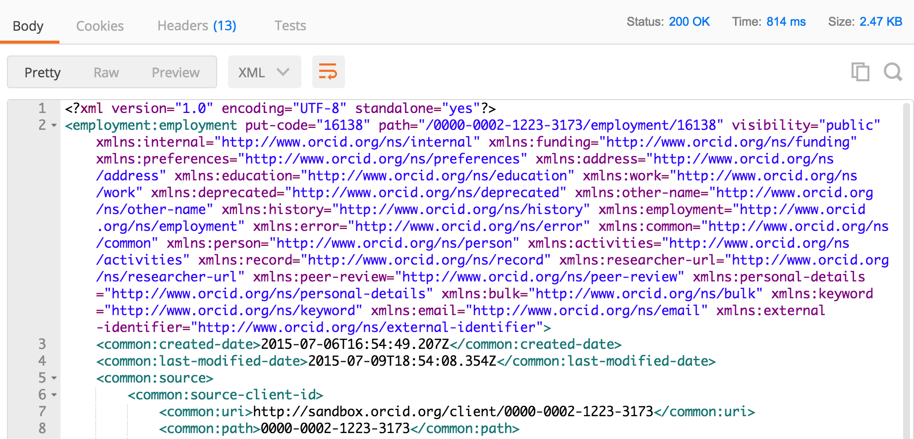

In this section, we'll use the Public API to take a look at the underlying data for our Sandbox record. 

##Read a record summary
1. Open Postman and click the **Builder** tab at the top of the screen
2. Set the request type to **GET**
3. In the **Enter request URL** field enter:<br>
```https://pub.sandbox.orcid.org/v2.0/[ORCID ID]/record```<br>
*Replace [ORCID ID] with the iD for your Sandbox record, format XXXX-XXXX-XXXX-XXXX*<br>

4. Click **Send**
5. A summary version of your record in XML format will appear in the **Body** section of the response<br>


##Read activity details
To get more information about a specific item on an ORCID record, you can retrieve that individual item using its put-code.

1. In the record summary XML, find the **activities-summary** section, then find the **put-code** for the employment item that you added in the previous section.<br>

2. In the **Request URL** field enter:<br>
```https://pub.sandbox.orcid.org/v2.0/[ORCID ID]/employment/[PUT CODE]```<br>
*Replace [ORCID ID] with the iD for your Sandbox record, format XXXX-XXXX-XXXX-XXXX and [PUT CODE] with the put-code for your employment item*<br>

3. Click **Send**
4. Fulls details of your employment entry will appear in the **Body** of the response section<br>
