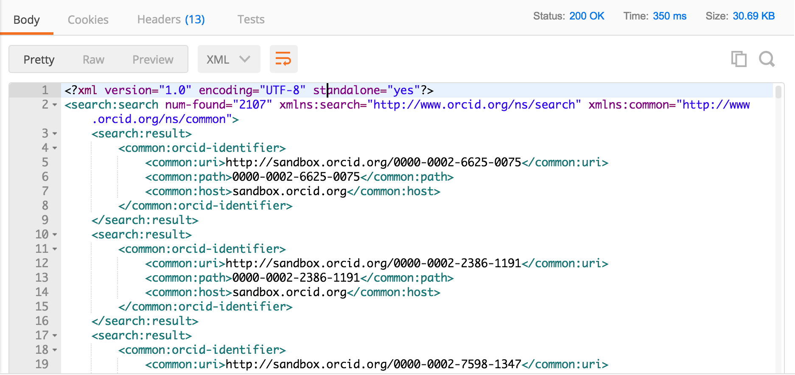

In addition to reading information on a specific ORCID record, you can use the API to search for ORCID records that contain specific information.

In this section, we'll try searches using just a few of the available fields. For a full list of fields that you can search, see our [Basic tutorial: Searching Data using the ORCID API](https://members.orcid.org/api/tutorial/search-orcid-registry)

##Get an access token
If you already have a token valid for the scope ```/read-public``` from the previous section, you can use that token.

If not, go back and follow the steps in [READ public info: Get an access token](read/#get-an-access-token)

##Search for records with an institutional affiliation
1. Open Postman and click the **Builder** tab at the top of the screen
2. Set the request type to **GET**
3. In the **Enter request URL** field enter:<br>
```https://pub.sandbox.orcid.org/v2.0/search/?q=affiliation-org-name:%22Boston%20University%22```<br>

4. Click the **Authorization** tab and set the Type dropdown to **OAuth 2.0**
5. Under **Existing Tokens**, select the **Read public** token, and set the **Add token to** dropdown to **Header** at right<br>
<br>
4. Click **Send the request**
5. The total number of matching ORCID iDs and a list of those iDs will appear **Request/Response** section<br>


##Paging search results
If your search matches more than 100 ORCID iDs, only the first 100 iDs will be returned in the list of results. To get the next set of results, you'll need to make another API request.

1. In the **Request URL** field enter:<br>
```https://pub.sandbox.orcid.org/v2.0/search/?q=affiliation-org-name:%22Boston%20University%22&start=101&rows=200```<br>
3. Click **Send**
4. The total number of matching ORCID iDs and a list of iDs 101-301 will appear in the **Body** section of the response<br>

To get the entire set of results, repeat the query in step 2, changing ```start=``` until you've reached collected all of your results.